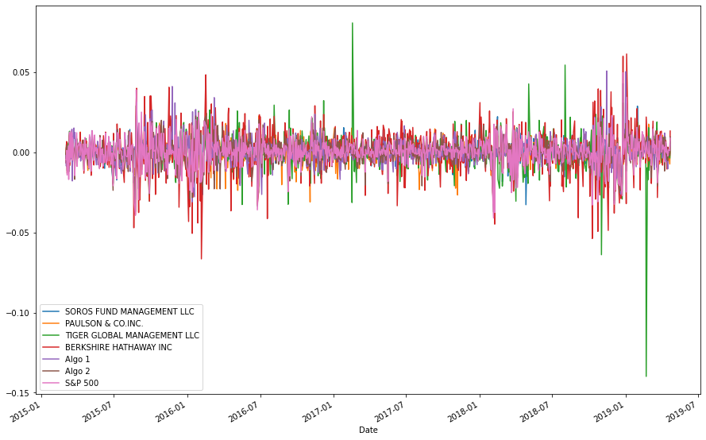
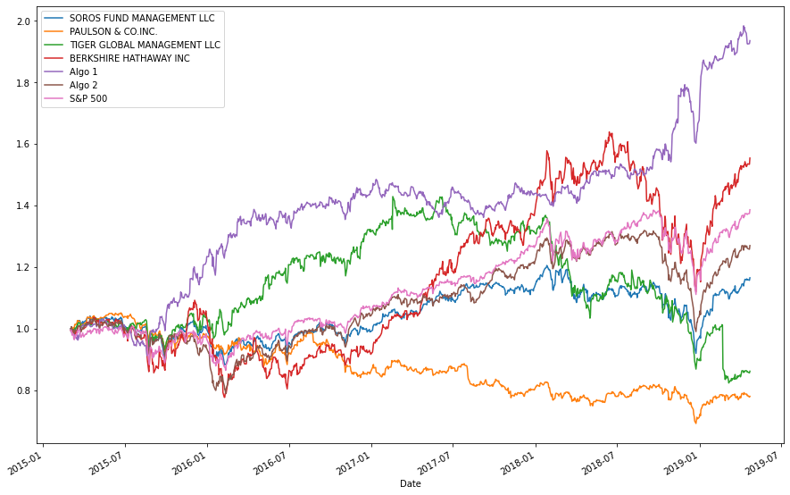
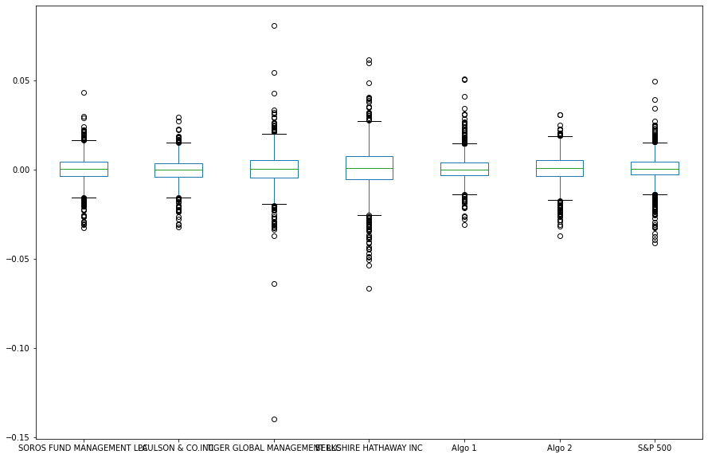
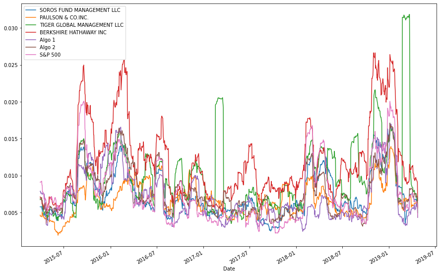
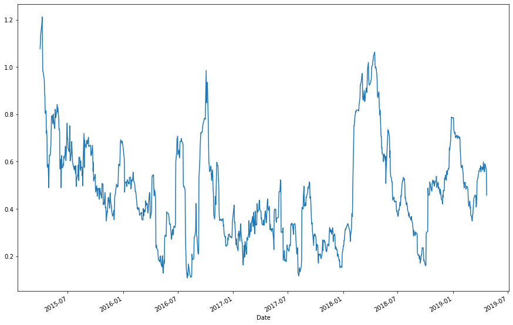
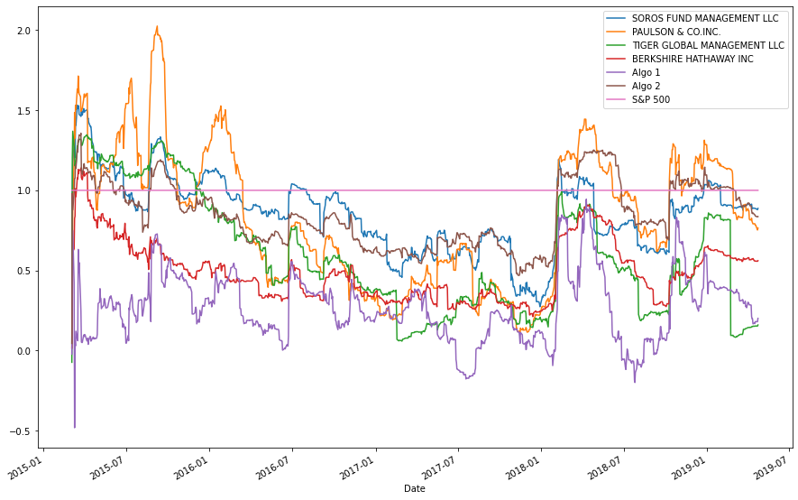
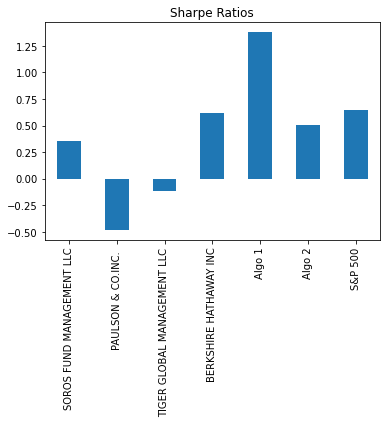
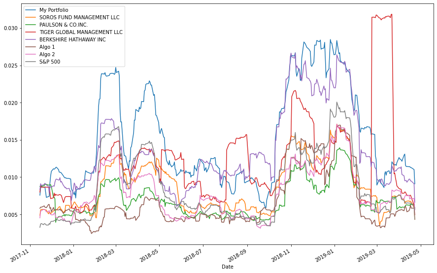
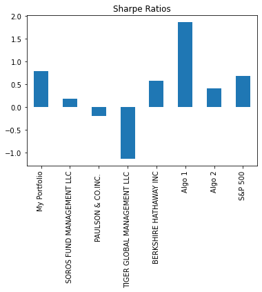
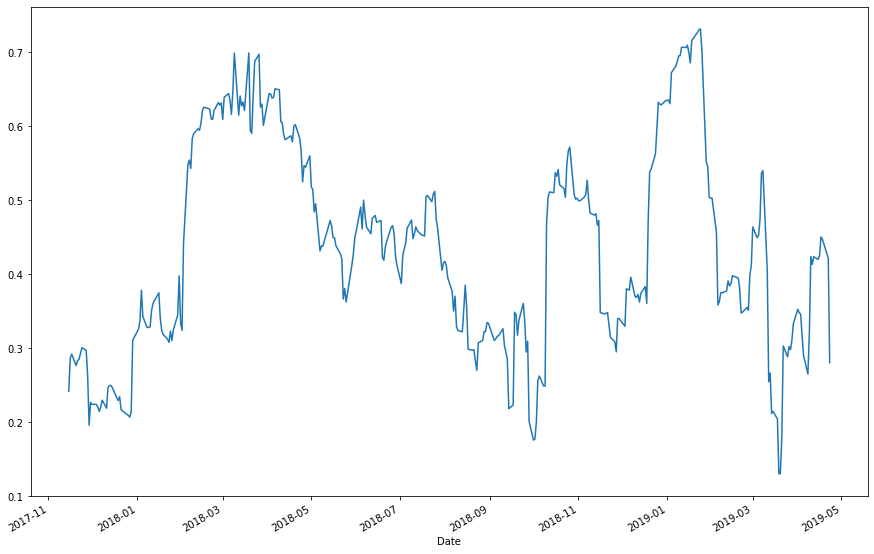

 #  A Whale off the Port(folio)


## Whale Returns

We are trying to determine which portfolio has performed best using data analysis. Here is the historic returns from "whale" investors, algorithmic portfolios, and the overall market of the S&P 500:

<table border="1" class="dataframe">
  <thead>
    <tr style="text-align: right;">
      <th></th>
      <th>SOROS FUND MANAGEMENT LLC</th>
      <th>PAULSON &amp; CO.INC.</th>
      <th>TIGER GLOBAL MANAGEMENT LLC</th>
      <th>BERKSHIRE HATHAWAY INC</th>
      <th>Algo 1</th>
      <th>Algo 2</th>
      <th>S&amp;P 500</th>
    </tr>
    <tr>
      <th>Date</th>
      <th></th>
      <th></th>
      <th></th>
      <th></th>
      <th></th>
      <th></th>
      <th></th>
    </tr>
  </thead>
  <tbody>
    <tr>
      <th>2015-03-03</th>
      <td>-0.001266</td>
      <td>-0.004981</td>
      <td>-0.000496</td>
      <td>-0.006569</td>
      <td>-0.001942</td>
      <td>-0.000949</td>
      <td>-0.004539</td>
    </tr>
    <tr>
      <th>2015-03-04</th>
      <td>0.002230</td>
      <td>0.003241</td>
      <td>-0.002534</td>
      <td>0.004213</td>
      <td>-0.008589</td>
      <td>0.002416</td>
      <td>-0.004389</td>
    </tr>
    <tr>
      <th>2015-03-05</th>
      <td>0.004016</td>
      <td>0.004076</td>
      <td>0.002355</td>
      <td>0.006726</td>
      <td>-0.000955</td>
      <td>0.004323</td>
      <td>0.001196</td>
    </tr>
    <tr>
      <th>2015-03-06</th>
      <td>-0.007905</td>
      <td>-0.003574</td>
      <td>-0.008481</td>
      <td>-0.013098</td>
      <td>-0.004957</td>
      <td>-0.011460</td>
      <td>-0.014174</td>
    </tr>
    <tr>
      <th>2015-03-09</th>
      <td>0.000582</td>
      <td>0.004225</td>
      <td>0.005843</td>
      <td>-0.001652</td>
      <td>-0.005447</td>
      <td>0.001303</td>
      <td>0.003944</td>
    </tr>
    <tr>
      <th>...</th>
      <td>...</td>
      <td>...</td>
      <td>...</td>
      <td>...</td>
      <td>...</td>
      <td>...</td>
      <td>...</td>
    </tr>
    <tr>
      <th>2019-04-16</th>
      <td>0.002699</td>
      <td>0.000388</td>
      <td>-0.000831</td>
      <td>0.000837</td>
      <td>-0.006945</td>
      <td>0.002899</td>
      <td>0.000509</td>
    </tr>
    <tr>
      <th>2019-04-17</th>
      <td>-0.002897</td>
      <td>-0.006467</td>
      <td>-0.004409</td>
      <td>0.003222</td>
      <td>-0.010301</td>
      <td>-0.005228</td>
      <td>-0.002274</td>
    </tr>
    <tr>
      <th>2019-04-18</th>
      <td>0.001448</td>
      <td>0.001222</td>
      <td>0.000582</td>
      <td>0.001916</td>
      <td>-0.000588</td>
      <td>-0.001229</td>
      <td>0.001579</td>
    </tr>
    <tr>
      <th>2019-04-22</th>
      <td>-0.002586</td>
      <td>-0.007333</td>
      <td>-0.003640</td>
      <td>-0.001088</td>
      <td>0.000677</td>
      <td>-0.001936</td>
      <td>0.001012</td>
    </tr>
    <tr>
      <th>2019-04-23</th>
      <td>0.007167</td>
      <td>0.003485</td>
      <td>0.006472</td>
      <td>0.013278</td>
      <td>0.004969</td>
      <td>0.009622</td>
      <td>0.008841</td>
    </tr>
  </tbody>
</table>
<p>1043 rows × 7 columns</p>
</div>


---

# Portfolio Analysis

In this section, you will calculate and visualize performance and risk metrics for the portfolios.

## Performance

Calculate and Plot the daily returns and cumulative returns. Does any portfolio outperform the S&P 500? 


```python
# Plot daily returns
daily_returns.plot(figsize = (15,10))
```


    <AxesSubplot:xlabel='Date'>


    

    


```python
# Plot cumulative returns
df_cum = daily_returns.cumsum(axis=0, skipna=True)
df_cum = (1 + daily_returns).cumprod()
df_cum.plot(figsize = (15,10))
```


    <AxesSubplot:xlabel='Date'>


    

    


## Risk

Determine the _risk_ of each portfolio:

1. Create a box plot for each portfolio. 
2. Calculate the standard deviation for all portfolios
4. Determine which portfolios are riskier than the S&P 500
5. Calculate the Annualized Standard Deviation


```python
# Box plot to visually show risk
daily_returns.plot(kind = "box", figsize = (15, 10))
```


    <AxesSubplot:>


    

    


```python
# Daily Standard Deviations
# Calculate the standard deviation for each portfolio. 
# Which portfolios are riskier than the S&P 500?
daily_returns_std = pd.DataFrame(daily_returns.std())
daily_returns_std.columns = ["STD"]
daily_returns_std
```


<div>
<style scoped>
    .dataframe tbody tr th:only-of-type {
        vertical-align: middle;
    }

    .dataframe tbody tr th {
        vertical-align: top;
    }

    .dataframe thead th {
        text-align: right;
    }
</style>
<table border="1" class="dataframe">
  <thead>
    <tr style="text-align: right;">
      <th></th>
      <th>STD</th>
    </tr>
  </thead>
  <tbody>
    <tr>
      <th>SOROS FUND MANAGEMENT LLC</th>
      <td>0.007895</td>
    </tr>
    <tr>
      <th>PAULSON &amp; CO.INC.</th>
      <td>0.007023</td>
    </tr>
    <tr>
      <th>TIGER GLOBAL MANAGEMENT LLC</th>
      <td>0.010894</td>
    </tr>
    <tr>
      <th>BERKSHIRE HATHAWAY INC</th>
      <td>0.012919</td>
    </tr>
    <tr>
      <th>Algo 1</th>
      <td>0.007620</td>
    </tr>
    <tr>
      <th>Algo 2</th>
      <td>0.008342</td>
    </tr>
    <tr>
      <th>S&amp;P 500</th>
      <td>0.008554</td>
    </tr>
  </tbody>
</table>
</div>


```python
# Determine which portfolios are riskier than the S&P 500
riskiest = daily_returns_std.loc[daily_returns_std["STD"] > daily_returns_std.loc["S&P 500", "STD"]]
riskiest
```


<div>
<style scoped>
    .dataframe tbody tr th:only-of-type {
        vertical-align: middle;
    }

    .dataframe tbody tr th {
        vertical-align: top;
    }

    .dataframe thead th {
        text-align: right;
    }
</style>
<table border="1" class="dataframe">
  <thead>
    <tr style="text-align: right;">
      <th></th>
      <th>STD</th>
    </tr>
  </thead>
  <tbody>
    <tr>
      <th>TIGER GLOBAL MANAGEMENT LLC</th>
      <td>0.010894</td>
    </tr>
    <tr>
      <th>BERKSHIRE HATHAWAY INC</th>
      <td>0.012919</td>
    </tr>
  </tbody>
</table>
</div>


```python
# Calculate the annualized standard deviation (252 trading days)
annualized_daily_returns_std = daily_returns_std * np.sqrt(252)
annualized_daily_returns_std
```


<div>
<style scoped>
    .dataframe tbody tr th:only-of-type {
        vertical-align: middle;
    }

    .dataframe tbody tr th {
        vertical-align: top;
    }

    .dataframe thead th {
        text-align: right;
    }
</style>
<table border="1" class="dataframe">
  <thead>
    <tr style="text-align: right;">
      <th></th>
      <th>STD</th>
    </tr>
  </thead>
  <tbody>
    <tr>
      <th>SOROS FUND MANAGEMENT LLC</th>
      <td>0.125335</td>
    </tr>
    <tr>
      <th>PAULSON &amp; CO.INC.</th>
      <td>0.111488</td>
    </tr>
    <tr>
      <th>TIGER GLOBAL MANAGEMENT LLC</th>
      <td>0.172936</td>
    </tr>
    <tr>
      <th>BERKSHIRE HATHAWAY INC</th>
      <td>0.205077</td>
    </tr>
    <tr>
      <th>Algo 1</th>
      <td>0.120967</td>
    </tr>
    <tr>
      <th>Algo 2</th>
      <td>0.132430</td>
    </tr>
    <tr>
      <th>S&amp;P 500</th>
      <td>0.135786</td>
    </tr>
  </tbody>
</table>
</div>


---

## Rolling Statistics

Risk changes over time. Analyze the rolling statistics for Risk and Beta. 

1. Plot the rolling standard deviation of the various portfolios along with the rolling standard deviation of the S&P 500 (consider a 21 day window). Does the risk increase for each of the portfolios at the same time risk increases in the S&P?
2. Construct a correlation table for the algorithmic, whale, and S&P 500 returns. Which returns most closely mimic the S&P?
3. Choose one portfolio and plot a rolling beta between that portfolio's returns and S&P 500 returns. Does the portfolio seem sensitive to movements in the S&P 500?
4. An alternative way to calculate a rolling window is to take the exponentially weighted moving average. This is like a moving window average, but it assigns greater importance to more recent observations. Try calculating the ewm with a 21 day half-life.


```python
# Calculate and plot the rolling standard deviation for
# the S&P 500 and whale portfolios using a 21 trading day window
daily_returns.rolling(window = 21).std().plot(figsize=(15, 10))
```


    <AxesSubplot:xlabel='Date'>


    

    


```python
# Construct a correlation table
correlation = daily_returns.corr()
print("Algo 2 has the highest correlation with S&P 500")
correlation
```

    Algo 2 has the highest correlation with S&P 500


<div>
<style scoped>
    .dataframe tbody tr th:only-of-type {
        vertical-align: middle;
    }

    .dataframe tbody tr th {
        vertical-align: top;
    }

    .dataframe thead th {
        text-align: right;
    }
</style>
<table border="1" class="dataframe">
  <thead>
    <tr style="text-align: right;">
      <th></th>
      <th>SOROS FUND MANAGEMENT LLC</th>
      <th>PAULSON &amp; CO.INC.</th>
      <th>TIGER GLOBAL MANAGEMENT LLC</th>
      <th>BERKSHIRE HATHAWAY INC</th>
      <th>Algo 1</th>
      <th>Algo 2</th>
      <th>S&amp;P 500</th>
    </tr>
  </thead>
  <tbody>
    <tr>
      <th>SOROS FUND MANAGEMENT LLC</th>
      <td>1.000000</td>
      <td>0.699914</td>
      <td>0.561243</td>
      <td>0.754360</td>
      <td>0.321211</td>
      <td>0.826873</td>
      <td>0.837864</td>
    </tr>
    <tr>
      <th>PAULSON &amp; CO.INC.</th>
      <td>0.699914</td>
      <td>1.000000</td>
      <td>0.434479</td>
      <td>0.545623</td>
      <td>0.268840</td>
      <td>0.678152</td>
      <td>0.669732</td>
    </tr>
    <tr>
      <th>TIGER GLOBAL MANAGEMENT LLC</th>
      <td>0.561243</td>
      <td>0.434479</td>
      <td>1.000000</td>
      <td>0.424423</td>
      <td>0.164387</td>
      <td>0.507414</td>
      <td>0.623946</td>
    </tr>
    <tr>
      <th>BERKSHIRE HATHAWAY INC</th>
      <td>0.754360</td>
      <td>0.545623</td>
      <td>0.424423</td>
      <td>1.000000</td>
      <td>0.292033</td>
      <td>0.688082</td>
      <td>0.751371</td>
    </tr>
    <tr>
      <th>Algo 1</th>
      <td>0.321211</td>
      <td>0.268840</td>
      <td>0.164387</td>
      <td>0.292033</td>
      <td>1.000000</td>
      <td>0.288243</td>
      <td>0.279494</td>
    </tr>
    <tr>
      <th>Algo 2</th>
      <td>0.826873</td>
      <td>0.678152</td>
      <td>0.507414</td>
      <td>0.688082</td>
      <td>0.288243</td>
      <td>1.000000</td>
      <td>0.858764</td>
    </tr>
    <tr>
      <th>S&amp;P 500</th>
      <td>0.837864</td>
      <td>0.669732</td>
      <td>0.623946</td>
      <td>0.751371</td>
      <td>0.279494</td>
      <td>0.858764</td>
      <td>1.000000</td>
    </tr>
  </tbody>
</table>
</div>


```python
# Calculate Beta for a single portfolio compared to the total market (S&P 500)
covariance_berkshire = daily_returns["BERKSHIRE HATHAWAY INC"].rolling(window = 21).cov(daily_returns["S&P 500"])
variance_berkshire = daily_returns["BERKSHIRE HATHAWAY INC"].rolling(window = 21).var()
beta_berkshire = covariance_berkshire / variance_berkshire
beta_berkshire.plot(kind='line', figsize=(15, 10))
```


    <AxesSubplot:xlabel='Date'>


    

    


```python
# Calculate a rolling window using the exponentially weighted moving average. 
covariance_daily_exponential = daily_returns.ewm(halflife = 21).cov(daily_returns["S&P 500"])
variance_daily_exponential = daily_returns.ewm(halflife = 21).var()
beta_daily_exponential = covariance_daily_exponential / variance_daily_exponential
beta_daily_exponential.plot(kind="line", figsize=(15, 10))
```


    <AxesSubplot:xlabel='Date'>


    

    


---

## Sharpe Ratios
In reality, investment managers and thier institutional investors look at the ratio of return-to-risk, and not just returns alone. (After all, if you could invest in one of two portfolios, each offered the same 10% return, yet one offered lower risk, you'd take that one, right?)

1. Using the daily returns, calculate and visualize the Sharpe ratios using a bar plot.
2. Determine whether the algorithmic strategies outperform both the market (S&P 500) and the whales portfolios.


```python
# Calculate annualized Sharpe Ratios
sharpe_ratios = (daily_returns.mean() * 252) / (daily_returns.std() * np.sqrt(252))
sharpe_ratios
```


    SOROS FUND MANAGEMENT LLC      0.356417
    PAULSON & CO.INC.             -0.483570
    TIGER GLOBAL MANAGEMENT LLC   -0.121060
    BERKSHIRE HATHAWAY INC         0.621810
    Algo 1                         1.378648
    Algo 2                         0.501364
    S&P 500                        0.648267
    dtype: float64


```python
# Visualize the sharpe ratios as a bar plot
sharpe_ratios.plot(kind='bar', title="Sharpe Ratios")
```


    <AxesSubplot:title={'center':'Sharpe Ratios'}>


    

    


On the basis of this performance metric, do our algo strategies outperform both 'the market' and the whales? Type your answer here:

---

# Portfolio Returns

In this section, you will build your own portfolio of stocks, calculate the returns, and compare the results to the Whale Portfolios and the S&P 500. 

1. Visit [Google Sheets](https://docs.google.com/spreadsheets/) and use the in-built Google Finance function to choose 3-5 stocks for your own portfolio.
2. Download the data as CSV files and calculate the portfolio returns.
3. Calculate the returns for each stock.
4. Using those returns, calculate the weighted returns for your entire portfolio assuming an equal number of shares for each stock.
5. Add your portfolio returns to the DataFrame with the other portfolios and rerun the analysis. How does your portfolio fair?


## Your analysis should include the following:

- Using all portfolios:
 - The annualized standard deviation (252 trading days) for all portfolios.
 - The plotted rolling standard deviation using a 21 trading day window for all portfolios.
 - The calculated annualized Sharpe Ratios and the accompanying bar plot visualization.
 - A correlation table.
- Using your custom portfolio and one other of your choosing:
 - The plotted beta. 

## Choose 3-5 custom stocks with at last 1 year's worth of historic prices and create a DataFrame of the closing prices and dates for each stock.


```python
# Read the first stock
AMD = Path("Resources/AMD.csv")
amd_history = pd.read_csv(AMD, index_col="Date", parse_dates=True, infer_datetime_format=True)
amd_history.rename(columns = {"Close":"AMD"}, inplace=True)
amd_history.sort_index(ascending=True, inplace=True)
amd_history.head()

```


<div>
<style scoped>
    .dataframe tbody tr th:only-of-type {
        vertical-align: middle;
    }

    .dataframe tbody tr th {
        vertical-align: top;
    }

    .dataframe thead th {
        text-align: right;
    }
</style>
<table border="1" class="dataframe">
  <thead>
    <tr style="text-align: right;">
      <th></th>
      <th>AMD</th>
    </tr>
    <tr>
      <th>Date</th>
      <th></th>
    </tr>
  </thead>
  <tbody>
    <tr>
      <th>2017-10-17</th>
      <td>14.16</td>
    </tr>
    <tr>
      <th>2017-10-18</th>
      <td>14.07</td>
    </tr>
    <tr>
      <th>2017-10-19</th>
      <td>13.95</td>
    </tr>
    <tr>
      <th>2017-10-20</th>
      <td>13.81</td>
    </tr>
    <tr>
      <th>2017-10-23</th>
      <td>14.10</td>
    </tr>
  </tbody>
</table>
</div>


```python
# Read the second stock
BA = Path("Resources/BA.csv")
ba_history = pd.read_csv(BA, index_col="Date", parse_dates=True, infer_datetime_format=True)
ba_history.rename(columns = {"Close":"BA"}, inplace=True)
ba_history.sort_index(ascending=True, inplace=True)
ba_history.head()
```


<div>
<style scoped>
    .dataframe tbody tr th:only-of-type {
        vertical-align: middle;
    }

    .dataframe tbody tr th {
        vertical-align: top;
    }

    .dataframe thead th {
        text-align: right;
    }
</style>
<table border="1" class="dataframe">
  <thead>
    <tr style="text-align: right;">
      <th></th>
      <th>BA</th>
    </tr>
    <tr>
      <th>Date</th>
      <th></th>
    </tr>
  </thead>
  <tbody>
    <tr>
      <th>2017-10-17</th>
      <td>258.619995</td>
    </tr>
    <tr>
      <th>2017-10-18</th>
      <td>260.040009</td>
    </tr>
    <tr>
      <th>2017-10-19</th>
      <td>259.040009</td>
    </tr>
    <tr>
      <th>2017-10-20</th>
      <td>264.750000</td>
    </tr>
    <tr>
      <th>2017-10-23</th>
      <td>262.320007</td>
    </tr>
  </tbody>
</table>
</div>


```python
# Read the third stock
NVDA = Path("Resources/NVDA.csv")
nvda_history = pd.read_csv(NVDA, index_col="Date", parse_dates=True, infer_datetime_format=True)
nvda_history.rename(columns = {"Close":"NVDA"}, inplace=True)
nvda_history.sort_index(ascending=True, inplace=True)
nvda_history.head()
```


<div>
<style scoped>
    .dataframe tbody tr th:only-of-type {
        vertical-align: middle;
    }

    .dataframe tbody tr th {
        vertical-align: top;
    }

    .dataframe thead th {
        text-align: right;
    }
</style>
<table border="1" class="dataframe">
  <thead>
    <tr style="text-align: right;">
      <th></th>
      <th>NVDA</th>
    </tr>
    <tr>
      <th>Date</th>
      <th></th>
    </tr>
  </thead>
  <tbody>
    <tr>
      <th>2017-10-17</th>
      <td>197.750000</td>
    </tr>
    <tr>
      <th>2017-10-18</th>
      <td>197.580002</td>
    </tr>
    <tr>
      <th>2017-10-19</th>
      <td>197.800003</td>
    </tr>
    <tr>
      <th>2017-10-20</th>
      <td>196.899994</td>
    </tr>
    <tr>
      <th>2017-10-23</th>
      <td>196.619995</td>
    </tr>
  </tbody>
</table>
</div>


```python
# Read the fourth stock
V = Path("Resources/V.csv")
v_history = pd.read_csv(V, index_col="Date", parse_dates=True, infer_datetime_format=True)
v_history.rename(columns = {"Close":"V"}, inplace=True)
v_history.sort_index(ascending=True, inplace=True)
v_history.head()
```


<div>
<style scoped>
    .dataframe tbody tr th:only-of-type {
        vertical-align: middle;
    }

    .dataframe tbody tr th {
        vertical-align: top;
    }

    .dataframe thead th {
        text-align: right;
    }
</style>
<table border="1" class="dataframe">
  <thead>
    <tr style="text-align: right;">
      <th></th>
      <th>V</th>
    </tr>
    <tr>
      <th>Date</th>
      <th></th>
    </tr>
  </thead>
  <tbody>
    <tr>
      <th>2017-10-17</th>
      <td>107.540001</td>
    </tr>
    <tr>
      <th>2017-10-18</th>
      <td>107.800003</td>
    </tr>
    <tr>
      <th>2017-10-19</th>
      <td>107.019997</td>
    </tr>
    <tr>
      <th>2017-10-20</th>
      <td>107.550003</td>
    </tr>
    <tr>
      <th>2017-10-23</th>
      <td>107.529999</td>
    </tr>
  </tbody>
</table>
</div>


```python
# Read the fifth stock
WMT = Path("Resources/WMT.csv")
wmt_history = pd.read_csv(WMT, index_col="Date", parse_dates=True, infer_datetime_format=True)
wmt_history.rename(columns = {"Close":"WMT"}, inplace=True)
wmt_history.sort_index(ascending=True, inplace=True)
wmt_history.head()
```


<div>
<style scoped>
    .dataframe tbody tr th:only-of-type {
        vertical-align: middle;
    }

    .dataframe tbody tr th {
        vertical-align: top;
    }

    .dataframe thead th {
        text-align: right;
    }
</style>
<table border="1" class="dataframe">
  <thead>
    <tr style="text-align: right;">
      <th></th>
      <th>WMT</th>
    </tr>
    <tr>
      <th>Date</th>
      <th></th>
    </tr>
  </thead>
  <tbody>
    <tr>
      <th>2017-10-17</th>
      <td>85.980003</td>
    </tr>
    <tr>
      <th>2017-10-18</th>
      <td>86.220001</td>
    </tr>
    <tr>
      <th>2017-10-19</th>
      <td>86.400002</td>
    </tr>
    <tr>
      <th>2017-10-20</th>
      <td>87.440002</td>
    </tr>
    <tr>
      <th>2017-10-23</th>
      <td>88.650002</td>
    </tr>
  </tbody>
</table>
</div>


```python
# Concatenate all stocks into a single DataFrame
my_portfolio = pd.concat([amd_history, ba_history, nvda_history, v_history, wmt_history], axis="columns", join="inner")
my_portfolio.sort_index(ascending = True, inplace = True)
my_portfolio.head()
```


<div>
<style scoped>
    .dataframe tbody tr th:only-of-type {
        vertical-align: middle;
    }

    .dataframe tbody tr th {
        vertical-align: top;
    }

    .dataframe thead th {
        text-align: right;
    }
</style>
<table border="1" class="dataframe">
  <thead>
    <tr style="text-align: right;">
      <th></th>
      <th>AMD</th>
      <th>BA</th>
      <th>NVDA</th>
      <th>V</th>
      <th>WMT</th>
    </tr>
    <tr>
      <th>Date</th>
      <th></th>
      <th></th>
      <th></th>
      <th></th>
      <th></th>
    </tr>
  </thead>
  <tbody>
    <tr>
      <th>2017-10-17</th>
      <td>14.16</td>
      <td>258.619995</td>
      <td>197.750000</td>
      <td>107.540001</td>
      <td>85.980003</td>
    </tr>
    <tr>
      <th>2017-10-18</th>
      <td>14.07</td>
      <td>260.040009</td>
      <td>197.580002</td>
      <td>107.800003</td>
      <td>86.220001</td>
    </tr>
    <tr>
      <th>2017-10-19</th>
      <td>13.95</td>
      <td>259.040009</td>
      <td>197.800003</td>
      <td>107.019997</td>
      <td>86.400002</td>
    </tr>
    <tr>
      <th>2017-10-20</th>
      <td>13.81</td>
      <td>264.750000</td>
      <td>196.899994</td>
      <td>107.550003</td>
      <td>87.440002</td>
    </tr>
    <tr>
      <th>2017-10-23</th>
      <td>14.10</td>
      <td>262.320007</td>
      <td>196.619995</td>
      <td>107.529999</td>
      <td>88.650002</td>
    </tr>
  </tbody>
</table>
</div>


```python
# Reset the index
my_portfolio.reset_index(level=None, drop=False, inplace=False, col_level=0, col_fill="")
```


<div>
<style scoped>
    .dataframe tbody tr th:only-of-type {
        vertical-align: middle;
    }

    .dataframe tbody tr th {
        vertical-align: top;
    }

    .dataframe thead th {
        text-align: right;
    }
</style>
<table border="1" class="dataframe">
  <thead>
    <tr style="text-align: right;">
      <th></th>
      <th>Date</th>
      <th>AMD</th>
      <th>BA</th>
      <th>NVDA</th>
      <th>V</th>
      <th>WMT</th>
    </tr>
  </thead>
  <tbody>
    <tr>
      <th>0</th>
      <td>2017-10-17</td>
      <td>14.160000</td>
      <td>258.619995</td>
      <td>197.750000</td>
      <td>107.540001</td>
      <td>85.980003</td>
    </tr>
    <tr>
      <th>1</th>
      <td>2017-10-18</td>
      <td>14.070000</td>
      <td>260.040009</td>
      <td>197.580002</td>
      <td>107.800003</td>
      <td>86.220001</td>
    </tr>
    <tr>
      <th>2</th>
      <td>2017-10-19</td>
      <td>13.950000</td>
      <td>259.040009</td>
      <td>197.800003</td>
      <td>107.019997</td>
      <td>86.400002</td>
    </tr>
    <tr>
      <th>3</th>
      <td>2017-10-20</td>
      <td>13.810000</td>
      <td>264.750000</td>
      <td>196.899994</td>
      <td>107.550003</td>
      <td>87.440002</td>
    </tr>
    <tr>
      <th>4</th>
      <td>2017-10-23</td>
      <td>14.100000</td>
      <td>262.320007</td>
      <td>196.619995</td>
      <td>107.529999</td>
      <td>88.650002</td>
    </tr>
    <tr>
      <th>...</th>
      <td>...</td>
      <td>...</td>
      <td>...</td>
      <td>...</td>
      <td>...</td>
      <td>...</td>
    </tr>
    <tr>
      <th>751</th>
      <td>2020-10-12</td>
      <td>84.290001</td>
      <td>167.350006</td>
      <td>569.039978</td>
      <td>206.399994</td>
      <td>144.250000</td>
    </tr>
    <tr>
      <th>752</th>
      <td>2020-10-13</td>
      <td>85.279999</td>
      <td>162.139999</td>
      <td>569.929993</td>
      <td>204.320007</td>
      <td>146.229996</td>
    </tr>
    <tr>
      <th>753</th>
      <td>2020-10-14</td>
      <td>84.209999</td>
      <td>163.240005</td>
      <td>563.809998</td>
      <td>202.199997</td>
      <td>143.940002</td>
    </tr>
    <tr>
      <th>754</th>
      <td>2020-10-15</td>
      <td>83.129997</td>
      <td>164.240005</td>
      <td>558.799988</td>
      <td>199.550003</td>
      <td>144.529999</td>
    </tr>
    <tr>
      <th>755</th>
      <td>2020-10-16</td>
      <td>83.169998</td>
      <td>167.350006</td>
      <td>552.460022</td>
      <td>200.259995</td>
      <td>144.710007</td>
    </tr>
  </tbody>
</table>
<p>756 rows × 6 columns</p>
</div>


```python
# Pivot so that each column of prices represents a unique symbol
sym_portfolio = my_portfolio.pivot_table(index = "Date")
sym_portfolio.head()
```


<div>
<style scoped>
    .dataframe tbody tr th:only-of-type {
        vertical-align: middle;
    }

    .dataframe tbody tr th {
        vertical-align: top;
    }

    .dataframe thead th {
        text-align: right;
    }
</style>
<table border="1" class="dataframe">
  <thead>
    <tr style="text-align: right;">
      <th></th>
      <th>AMD</th>
      <th>BA</th>
      <th>NVDA</th>
      <th>V</th>
      <th>WMT</th>
    </tr>
    <tr>
      <th>Date</th>
      <th></th>
      <th></th>
      <th></th>
      <th></th>
      <th></th>
    </tr>
  </thead>
  <tbody>
    <tr>
      <th>2017-10-17</th>
      <td>14.16</td>
      <td>258.619995</td>
      <td>197.750000</td>
      <td>107.540001</td>
      <td>85.980003</td>
    </tr>
    <tr>
      <th>2017-10-18</th>
      <td>14.07</td>
      <td>260.040009</td>
      <td>197.580002</td>
      <td>107.800003</td>
      <td>86.220001</td>
    </tr>
    <tr>
      <th>2017-10-19</th>
      <td>13.95</td>
      <td>259.040009</td>
      <td>197.800003</td>
      <td>107.019997</td>
      <td>86.400002</td>
    </tr>
    <tr>
      <th>2017-10-20</th>
      <td>13.81</td>
      <td>264.750000</td>
      <td>196.899994</td>
      <td>107.550003</td>
      <td>87.440002</td>
    </tr>
    <tr>
      <th>2017-10-23</th>
      <td>14.10</td>
      <td>262.320007</td>
      <td>196.619995</td>
      <td>107.529999</td>
      <td>88.650002</td>
    </tr>
  </tbody>
</table>
</div>


```python
# Drop Nulls
sym_portfolio.dropna(inplace=True)
sym_portfolio
```


<div>
<style scoped>
    .dataframe tbody tr th:only-of-type {
        vertical-align: middle;
    }

    .dataframe tbody tr th {
        vertical-align: top;
    }

    .dataframe thead th {
        text-align: right;
    }
</style>
<table border="1" class="dataframe">
  <thead>
    <tr style="text-align: right;">
      <th></th>
      <th>AMD</th>
      <th>BA</th>
      <th>NVDA</th>
      <th>V</th>
      <th>WMT</th>
    </tr>
    <tr>
      <th>Date</th>
      <th></th>
      <th></th>
      <th></th>
      <th></th>
      <th></th>
    </tr>
  </thead>
  <tbody>
    <tr>
      <th>2017-10-17</th>
      <td>14.160000</td>
      <td>258.619995</td>
      <td>197.750000</td>
      <td>107.540001</td>
      <td>85.980003</td>
    </tr>
    <tr>
      <th>2017-10-18</th>
      <td>14.070000</td>
      <td>260.040009</td>
      <td>197.580002</td>
      <td>107.800003</td>
      <td>86.220001</td>
    </tr>
    <tr>
      <th>2017-10-19</th>
      <td>13.950000</td>
      <td>259.040009</td>
      <td>197.800003</td>
      <td>107.019997</td>
      <td>86.400002</td>
    </tr>
    <tr>
      <th>2017-10-20</th>
      <td>13.810000</td>
      <td>264.750000</td>
      <td>196.899994</td>
      <td>107.550003</td>
      <td>87.440002</td>
    </tr>
    <tr>
      <th>2017-10-23</th>
      <td>14.100000</td>
      <td>262.320007</td>
      <td>196.619995</td>
      <td>107.529999</td>
      <td>88.650002</td>
    </tr>
    <tr>
      <th>...</th>
      <td>...</td>
      <td>...</td>
      <td>...</td>
      <td>...</td>
      <td>...</td>
    </tr>
    <tr>
      <th>2020-10-12</th>
      <td>84.290001</td>
      <td>167.350006</td>
      <td>569.039978</td>
      <td>206.399994</td>
      <td>144.250000</td>
    </tr>
    <tr>
      <th>2020-10-13</th>
      <td>85.279999</td>
      <td>162.139999</td>
      <td>569.929993</td>
      <td>204.320007</td>
      <td>146.229996</td>
    </tr>
    <tr>
      <th>2020-10-14</th>
      <td>84.209999</td>
      <td>163.240005</td>
      <td>563.809998</td>
      <td>202.199997</td>
      <td>143.940002</td>
    </tr>
    <tr>
      <th>2020-10-15</th>
      <td>83.129997</td>
      <td>164.240005</td>
      <td>558.799988</td>
      <td>199.550003</td>
      <td>144.529999</td>
    </tr>
    <tr>
      <th>2020-10-16</th>
      <td>83.169998</td>
      <td>167.350006</td>
      <td>552.460022</td>
      <td>200.259995</td>
      <td>144.710007</td>
    </tr>
  </tbody>
</table>
<p>756 rows × 5 columns</p>
</div>


## Calculate the weighted returns for the portfolio assuming an equal number of shares for each stock


```python
# Calculate weighted portfolio returns
weights = [1/5, 1/5, 1/5, 1/5, 1/5]
my_portfolio = sym_portfolio.dot(weights)
my_portfolio_returns = my_portfolio.pct_change()
my_portfolio_returns.dropna(inplace=True)
my_portfolio_returns
```


    Date
    2017-10-18    0.002500
    2017-10-19   -0.002253
    2017-10-20    0.009395
    2017-10-23   -0.001835
    2017-10-24    0.009115
                    ...   
    2020-10-12    0.018229
    2020-10-13   -0.002928
    2020-10-14   -0.008990
    2020-10-15   -0.006178
    2020-10-16   -0.002000
    Length: 755, dtype: float64


## Join your portfolio returns to the DataFrame that contains all of the portfolio returns


```python
# Add your "Custom" portfolio to the larger dataframe of fund returns
portfolio_returns = pd.concat((my_portfolio_returns, daily_returns), axis = "columns", join = "inner")
portfolio_returns.rename(columns = {0:"My Portfolio"}, inplace = True)
portfolio_returns
```


<div>
<style scoped>
    .dataframe tbody tr th:only-of-type {
        vertical-align: middle;
    }

    .dataframe tbody tr th {
        vertical-align: top;
    }

    .dataframe thead th {
        text-align: right;
    }
</style>
<table border="1" class="dataframe">
  <thead>
    <tr style="text-align: right;">
      <th></th>
      <th>My Portfolio</th>
      <th>SOROS FUND MANAGEMENT LLC</th>
      <th>PAULSON &amp; CO.INC.</th>
      <th>TIGER GLOBAL MANAGEMENT LLC</th>
      <th>BERKSHIRE HATHAWAY INC</th>
      <th>Algo 1</th>
      <th>Algo 2</th>
      <th>S&amp;P 500</th>
    </tr>
    <tr>
      <th>Date</th>
      <th></th>
      <th></th>
      <th></th>
      <th></th>
      <th></th>
      <th></th>
      <th></th>
      <th></th>
    </tr>
  </thead>
  <tbody>
    <tr>
      <th>2017-10-18</th>
      <td>0.002500</td>
      <td>-0.001167</td>
      <td>-0.007151</td>
      <td>-0.002460</td>
      <td>0.004949</td>
      <td>-0.001652</td>
      <td>-0.000138</td>
      <td>0.000742</td>
    </tr>
    <tr>
      <th>2017-10-19</th>
      <td>-0.002253</td>
      <td>-0.002063</td>
      <td>0.005359</td>
      <td>-0.006275</td>
      <td>-0.010606</td>
      <td>0.000585</td>
      <td>-0.001053</td>
      <td>0.000328</td>
    </tr>
    <tr>
      <th>2017-10-20</th>
      <td>0.009395</td>
      <td>0.002271</td>
      <td>-0.000603</td>
      <td>0.004499</td>
      <td>0.002820</td>
      <td>-0.002531</td>
      <td>0.003606</td>
      <td>0.005117</td>
    </tr>
    <tr>
      <th>2017-10-23</th>
      <td>-0.001835</td>
      <td>-0.004255</td>
      <td>-0.004292</td>
      <td>0.002513</td>
      <td>-0.008789</td>
      <td>-0.004601</td>
      <td>-0.005884</td>
      <td>-0.003972</td>
    </tr>
    <tr>
      <th>2017-10-24</th>
      <td>0.009115</td>
      <td>-0.004026</td>
      <td>-0.001726</td>
      <td>0.003547</td>
      <td>0.002099</td>
      <td>-0.004328</td>
      <td>-0.000893</td>
      <td>0.001618</td>
    </tr>
    <tr>
      <th>...</th>
      <td>...</td>
      <td>...</td>
      <td>...</td>
      <td>...</td>
      <td>...</td>
      <td>...</td>
      <td>...</td>
      <td>...</td>
    </tr>
    <tr>
      <th>2019-04-16</th>
      <td>0.012536</td>
      <td>0.002699</td>
      <td>0.000388</td>
      <td>-0.000831</td>
      <td>0.000837</td>
      <td>-0.006945</td>
      <td>0.002899</td>
      <td>0.000509</td>
    </tr>
    <tr>
      <th>2019-04-17</th>
      <td>-0.005946</td>
      <td>-0.002897</td>
      <td>-0.006467</td>
      <td>-0.004409</td>
      <td>0.003222</td>
      <td>-0.010301</td>
      <td>-0.005228</td>
      <td>-0.002274</td>
    </tr>
    <tr>
      <th>2019-04-18</th>
      <td>0.001741</td>
      <td>0.001448</td>
      <td>0.001222</td>
      <td>0.000582</td>
      <td>0.001916</td>
      <td>-0.000588</td>
      <td>-0.001229</td>
      <td>0.001579</td>
    </tr>
    <tr>
      <th>2019-04-22</th>
      <td>-0.003266</td>
      <td>-0.002586</td>
      <td>-0.007333</td>
      <td>-0.003640</td>
      <td>-0.001088</td>
      <td>0.000677</td>
      <td>-0.001936</td>
      <td>0.001012</td>
    </tr>
    <tr>
      <th>2019-04-23</th>
      <td>0.003276</td>
      <td>0.007167</td>
      <td>0.003485</td>
      <td>0.006472</td>
      <td>0.013278</td>
      <td>0.004969</td>
      <td>0.009622</td>
      <td>0.008841</td>
    </tr>
  </tbody>
</table>
<p>379 rows × 8 columns</p>
</div>


```python
# Only compare dates where return data exists for all the stocks (drop NaNs)
portfolio_returns.dropna(inplace=True)
portfolio_returns
```


<div>
<style scoped>
    .dataframe tbody tr th:only-of-type {
        vertical-align: middle;
    }

    .dataframe tbody tr th {
        vertical-align: top;
    }

    .dataframe thead th {
        text-align: right;
    }
</style>
<table border="1" class="dataframe">
  <thead>
    <tr style="text-align: right;">
      <th></th>
      <th>My Portfolio</th>
      <th>SOROS FUND MANAGEMENT LLC</th>
      <th>PAULSON &amp; CO.INC.</th>
      <th>TIGER GLOBAL MANAGEMENT LLC</th>
      <th>BERKSHIRE HATHAWAY INC</th>
      <th>Algo 1</th>
      <th>Algo 2</th>
      <th>S&amp;P 500</th>
    </tr>
    <tr>
      <th>Date</th>
      <th></th>
      <th></th>
      <th></th>
      <th></th>
      <th></th>
      <th></th>
      <th></th>
      <th></th>
    </tr>
  </thead>
  <tbody>
    <tr>
      <th>2017-10-18</th>
      <td>0.002500</td>
      <td>-0.001167</td>
      <td>-0.007151</td>
      <td>-0.002460</td>
      <td>0.004949</td>
      <td>-0.001652</td>
      <td>-0.000138</td>
      <td>0.000742</td>
    </tr>
    <tr>
      <th>2017-10-19</th>
      <td>-0.002253</td>
      <td>-0.002063</td>
      <td>0.005359</td>
      <td>-0.006275</td>
      <td>-0.010606</td>
      <td>0.000585</td>
      <td>-0.001053</td>
      <td>0.000328</td>
    </tr>
    <tr>
      <th>2017-10-20</th>
      <td>0.009395</td>
      <td>0.002271</td>
      <td>-0.000603</td>
      <td>0.004499</td>
      <td>0.002820</td>
      <td>-0.002531</td>
      <td>0.003606</td>
      <td>0.005117</td>
    </tr>
    <tr>
      <th>2017-10-23</th>
      <td>-0.001835</td>
      <td>-0.004255</td>
      <td>-0.004292</td>
      <td>0.002513</td>
      <td>-0.008789</td>
      <td>-0.004601</td>
      <td>-0.005884</td>
      <td>-0.003972</td>
    </tr>
    <tr>
      <th>2017-10-24</th>
      <td>0.009115</td>
      <td>-0.004026</td>
      <td>-0.001726</td>
      <td>0.003547</td>
      <td>0.002099</td>
      <td>-0.004328</td>
      <td>-0.000893</td>
      <td>0.001618</td>
    </tr>
    <tr>
      <th>...</th>
      <td>...</td>
      <td>...</td>
      <td>...</td>
      <td>...</td>
      <td>...</td>
      <td>...</td>
      <td>...</td>
      <td>...</td>
    </tr>
    <tr>
      <th>2019-04-16</th>
      <td>0.012536</td>
      <td>0.002699</td>
      <td>0.000388</td>
      <td>-0.000831</td>
      <td>0.000837</td>
      <td>-0.006945</td>
      <td>0.002899</td>
      <td>0.000509</td>
    </tr>
    <tr>
      <th>2019-04-17</th>
      <td>-0.005946</td>
      <td>-0.002897</td>
      <td>-0.006467</td>
      <td>-0.004409</td>
      <td>0.003222</td>
      <td>-0.010301</td>
      <td>-0.005228</td>
      <td>-0.002274</td>
    </tr>
    <tr>
      <th>2019-04-18</th>
      <td>0.001741</td>
      <td>0.001448</td>
      <td>0.001222</td>
      <td>0.000582</td>
      <td>0.001916</td>
      <td>-0.000588</td>
      <td>-0.001229</td>
      <td>0.001579</td>
    </tr>
    <tr>
      <th>2019-04-22</th>
      <td>-0.003266</td>
      <td>-0.002586</td>
      <td>-0.007333</td>
      <td>-0.003640</td>
      <td>-0.001088</td>
      <td>0.000677</td>
      <td>-0.001936</td>
      <td>0.001012</td>
    </tr>
    <tr>
      <th>2019-04-23</th>
      <td>0.003276</td>
      <td>0.007167</td>
      <td>0.003485</td>
      <td>0.006472</td>
      <td>0.013278</td>
      <td>0.004969</td>
      <td>0.009622</td>
      <td>0.008841</td>
    </tr>
  </tbody>
</table>
<p>379 rows × 8 columns</p>
</div>


## Re-run the performance and risk analysis with your portfolio to see how it compares to the others


```python
# Risk
portfolio_returns_std = pd.DataFrame(portfolio_returns.std())
portfolio_returns_std.columns = ["STD"]

annualized_portfolio_returns_std = portfolio_returns_std * np.sqrt(252)
annualized_portfolio_returns_std
```


<div>
<style scoped>
    .dataframe tbody tr th:only-of-type {
        vertical-align: middle;
    }

    .dataframe tbody tr th {
        vertical-align: top;
    }

    .dataframe thead th {
        text-align: right;
    }
</style>
<table border="1" class="dataframe">
  <thead>
    <tr style="text-align: right;">
      <th></th>
      <th>STD</th>
    </tr>
  </thead>
  <tbody>
    <tr>
      <th>My Portfolio</th>
      <td>0.256996</td>
    </tr>
    <tr>
      <th>SOROS FUND MANAGEMENT LLC</th>
      <td>0.143917</td>
    </tr>
    <tr>
      <th>PAULSON &amp; CO.INC.</th>
      <td>0.116172</td>
    </tr>
    <tr>
      <th>TIGER GLOBAL MANAGEMENT LLC</th>
      <td>0.211266</td>
    </tr>
    <tr>
      <th>BERKSHIRE HATHAWAY INC</th>
      <td>0.223649</td>
    </tr>
    <tr>
      <th>Algo 1</th>
      <td>0.117606</td>
    </tr>
    <tr>
      <th>Algo 2</th>
      <td>0.133711</td>
    </tr>
    <tr>
      <th>S&amp;P 500</th>
      <td>0.151731</td>
    </tr>
  </tbody>
</table>
</div>


```python
# Rolling
portfolio_returns.rolling(window = 21).std().plot(figsize=(15,10))
```


    <AxesSubplot:xlabel='Date'>


    

    


```python
# Annualized Sharpe Ratios
new_sharpe_ratios = (portfolio_returns.mean() * 252) / (portfolio_returns.std() * np.sqrt(252))
new_sharpe_ratios
```


    My Portfolio                   0.790235
    SOROS FUND MANAGEMENT LLC      0.180889
    PAULSON & CO.INC.             -0.205104
    TIGER GLOBAL MANAGEMENT LLC   -1.140460
    BERKSHIRE HATHAWAY INC         0.575400
    Algo 1                         1.861298
    Algo 2                         0.411675
    S&P 500                        0.674151
    dtype: float64


```python
# Visualize the sharpe ratios as a bar plot
new_sharpe_ratios.plot(kind='bar', title="Sharpe Ratios")
```


    <AxesSubplot:title={'center':'Sharpe Ratios'}>


    

    


```python
# Create a correlation analysis
new_correlation = portfolio_returns.corr()
print("Algo 2 still has the highest correlation with S&P 500")
new_correlation
```

    Algo 2 still has the highest correlation with S&P 500


<div>
<style scoped>
    .dataframe tbody tr th:only-of-type {
        vertical-align: middle;
    }

    .dataframe tbody tr th {
        vertical-align: top;
    }

    .dataframe thead th {
        text-align: right;
    }
</style>
<table border="1" class="dataframe">
  <thead>
    <tr style="text-align: right;">
      <th></th>
      <th>My Portfolio</th>
      <th>SOROS FUND MANAGEMENT LLC</th>
      <th>PAULSON &amp; CO.INC.</th>
      <th>TIGER GLOBAL MANAGEMENT LLC</th>
      <th>BERKSHIRE HATHAWAY INC</th>
      <th>Algo 1</th>
      <th>Algo 2</th>
      <th>S&amp;P 500</th>
    </tr>
  </thead>
  <tbody>
    <tr>
      <th>My Portfolio</th>
      <td>1.000000</td>
      <td>0.679664</td>
      <td>0.579324</td>
      <td>0.403140</td>
      <td>0.763582</td>
      <td>0.243830</td>
      <td>0.723187</td>
      <td>0.829311</td>
    </tr>
    <tr>
      <th>SOROS FUND MANAGEMENT LLC</th>
      <td>0.679664</td>
      <td>1.000000</td>
      <td>0.751071</td>
      <td>0.511691</td>
      <td>0.780257</td>
      <td>0.326331</td>
      <td>0.828155</td>
      <td>0.831343</td>
    </tr>
    <tr>
      <th>PAULSON &amp; CO.INC.</th>
      <td>0.579324</td>
      <td>0.751071</td>
      <td>1.000000</td>
      <td>0.492073</td>
      <td>0.626057</td>
      <td>0.337278</td>
      <td>0.772946</td>
      <td>0.748047</td>
    </tr>
    <tr>
      <th>TIGER GLOBAL MANAGEMENT LLC</th>
      <td>0.403140</td>
      <td>0.511691</td>
      <td>0.492073</td>
      <td>1.000000</td>
      <td>0.372517</td>
      <td>0.134633</td>
      <td>0.479858</td>
      <td>0.557858</td>
    </tr>
    <tr>
      <th>BERKSHIRE HATHAWAY INC</th>
      <td>0.763582</td>
      <td>0.780257</td>
      <td>0.626057</td>
      <td>0.372517</td>
      <td>1.000000</td>
      <td>0.310652</td>
      <td>0.779185</td>
      <td>0.830721</td>
    </tr>
    <tr>
      <th>Algo 1</th>
      <td>0.243830</td>
      <td>0.326331</td>
      <td>0.337278</td>
      <td>0.134633</td>
      <td>0.310652</td>
      <td>1.000000</td>
      <td>0.317405</td>
      <td>0.269803</td>
    </tr>
    <tr>
      <th>Algo 2</th>
      <td>0.723187</td>
      <td>0.828155</td>
      <td>0.772946</td>
      <td>0.479858</td>
      <td>0.779185</td>
      <td>0.317405</td>
      <td>1.000000</td>
      <td>0.878185</td>
    </tr>
    <tr>
      <th>S&amp;P 500</th>
      <td>0.829311</td>
      <td>0.831343</td>
      <td>0.748047</td>
      <td>0.557858</td>
      <td>0.830721</td>
      <td>0.269803</td>
      <td>0.878185</td>
      <td>1.000000</td>
    </tr>
  </tbody>
</table>
</div>


```python
# Beta
cov_portfolio = portfolio_returns["My Portfolio"].rolling(window = 21).cov(portfolio_returns["S&P 500"])
var_portfolio = portfolio_returns["My Portfolio"].rolling(window = 21).var()
beta_portfolio = cov_portfolio / var_portfolio
beta_portfolio.plot(kind='line', figsize=(15, 10))
```


    <AxesSubplot:xlabel='Date'>


    

    


```python

```
